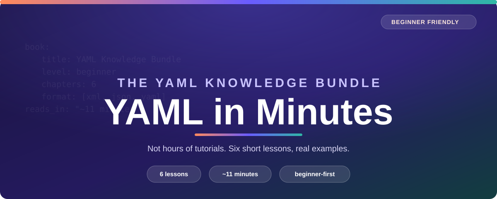

# YAML Knowledge Bundle

## Stop watching hour-long YAML tutorials.

You don't need a video course to learn YAML. You need six short, focused pages and about **11 minutes**. This bundle gets you from "what's a scalar?" to confidently reading and writing real Kubernetes manifests, GitHub Actions workflows, and CI configs — with plain-English explanations, friendly analogies, and copy-pasteable examples at every step.

## Why this instead of a tutorial video

- ⏱ **~11 minutes, 6 bite-sized lessons** — most pages are a 1-4 minute read, not a 45-minute video you have to scrub through.
- 🧠 **Beginner-first, jargon explained** — every technical term (scalar, anchor, mapping...) gets a plain-English analogy before the syntax.
- 🧪 **Real, runnable examples** — every concept ships with working YAML you can copy into your own editor, not just prose.
- 🖼 **Visual, not just verbal** — diagrams for structure, anchors, and format comparisons.
- ✅ **Validated, not just written** — finish by learning `yamllint`, so your YAML is correct before it ever hits a pipeline.

## Start learning → [index.md](index.md)

| # | Lesson | Time | What you'll walk away with |
|---|---|---|---|
| 1 | [XML vs JSON vs YAML](content/01-xml-vs-json-vs-yaml.md) | 2 min | Why YAML won for config files |
| 2 | [YAML — Evolution](content/02-yaml-evolution.md) | 1 min | The XML → JSON → YAML story |
| 3 | [Creating a simple YAML — VS Code](content/03-creating-simple-yaml-vscode.md) | 1 min | Your first `.yaml` file, done right |
| 4 | [YAML Basic Concepts](content/04-basic-concepts.md) | 4 min | Scalars, strings, sequences, dictionaries |
| 5 | [YAML Advance Concepts](content/05-advance-concepts.md) | 2 min | Anchors, aliases, overrides, multi-doc files |
| 6 | [Validating YAML with yamllint](content/06-validating-yaml-yamllint.md) | 1 min | Catch mistakes before they ship |

**Total: ~11 minutes.** Grab a coffee, not a weekend.

## Who this is for

Anyone who needs to read or write YAML for Kubernetes, GitHub Actions, Ansible, Docker Compose, or CI pipelines — and would rather learn it properly in one sitting than piece it together from scattered Stack Overflow answers.

No prior YAML knowledge assumed. Basic comfort with a text editor is all you need.

## What's inside

- `content/` — the six lessons above, in reading order
- `assets/code/` — example YAML files you can copy and run
- `assets/images/` — diagrams referenced from the lessons
- `datapackage.json` — [Open Knowledge Format](https://okfn.org/) (OKF)-style metadata for this bundle

## Contributing

Found a typo, a confusing explanation, or want to add a lesson? See [CONTRIBUTING.md](CONTRIBUTING.md).
