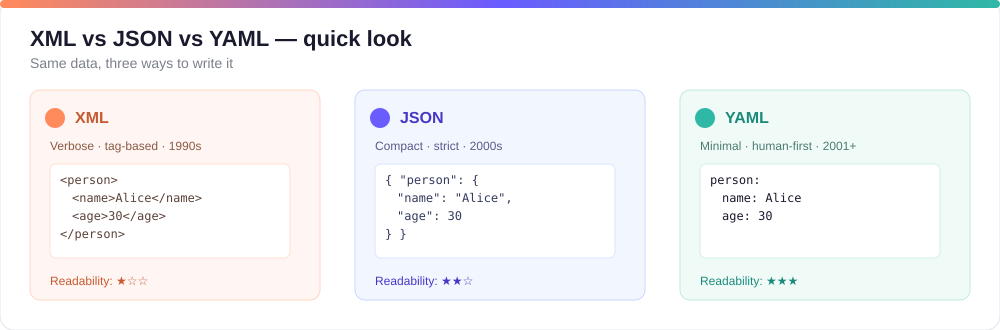

# XML vs JSON vs YAML

By Abhijeet Bhagat • 2 min read

YAML is a superset of JSON — any valid JSON is valid YAML. A helpful analogy: if JavaScript is like JSON, then TypeScript is like YAML (YAML adds features that make files easier to author and read).



Quick comparison (for beginners)

| Property | XML | JSON | YAML |
|---|---:|---:|:---|
| Human readability | Hard 😠 | Hard 😠 | Easy 😊 |
| Syntax | Verbose, tags | Explicit, strict | Minimalist, indentation-based |
| Comments | ✅ | ❌ (JSONC allows comments) | ✅ |
| Hierarchy | Opening/closing tags <tag>...</tag> | Curly braces { } | Indentation (spaces) |
| Size for transfer | Heavier ⬆️ | Lighter ⬇️ | Lighter ⬇️ |
| Typical use cases | Document-style data, legacy systems | APIs, data interchange | Configuration, CI, human-edited files |

Notes for beginners

- YAML is designed to be easy to read and write by humans. It removes closing tags and uses indentation to show structure.
- JSON is stricter (no comments in standard JSON), which is good for machine-to-machine communication but less convenient for hand-editing.
- XML is powerful and schema-driven, but more verbose and harder to read for small configs.

Short examples (same data in three formats)

JSON:

```json
{
  "person": {"name": "Alice", "age": 30, "skills": ["yaml", "writing"]}
}
```

YAML equivalent:

```yaml
person:
  name: Alice
  age: 30
  skills:
    - yaml
    - writing
```

XML equivalent:

```xml
<person>
  <name>Alice</name>
  <age>30</age>
  <skills>
    <skill>yaml</skill>
    <skill>writing</skill>
  </skills>
</person>
```

When to choose which

- Choose YAML when humans will read and edit the file (config files, CI pipelines, local settings).
- Choose JSON when you need strict, compact, machine-first data interchange (APIs).
- Choose XML when you need document features, XML tooling, or strict schema validation.

Tools and applications that use YAML heavily

- Kubernetes (manifests)
- Ansible (playbooks)
- GitHub Actions (workflows)
- Docker Compose
- GitLab CI
- Home Assistant

Exercise (quick)

Convert this JSON to YAML:

```json
{"colors": ["red", "green", "blue"], "primary": "red"}
```

Answer:

```yaml
colors:
  - red
  - green
  - blue
primary: red
```
