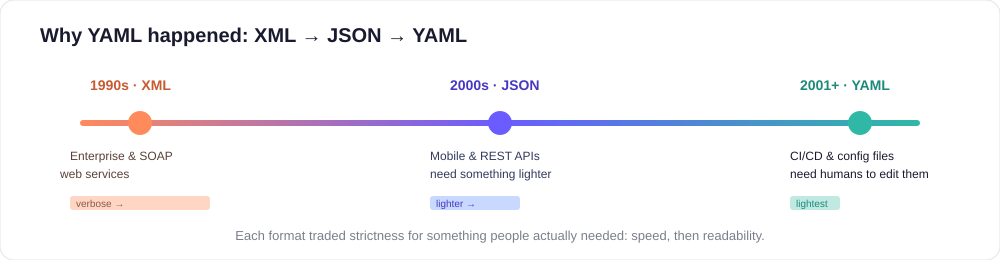

# 2. YAML — Evolution

Let's see why YAML is different from XML and JSON, and why YAML has become so popular for configuration and human-edited files.



Quick timeline

- 1990s — XML appears and becomes widely used for data serialization and document interchange. It uses opening and closing tags (e.g., <tag>...</tag>) and is schema-friendly.
- 2000s — JSON gains popularity because it is much lighter and maps directly to JavaScript objects (uses `{}` and `[]`). REST APIs and web services began favoring JSON for machine-to-machine communication.
- 2001 onward — YAML is introduced as a human-friendly data format. YAML 1.2 (published 2009) explicitly aligns with JSON so that any valid JSON is also valid YAML.

Why XML was widely used

- XML was the first broadly-adopted format for data exchange on the web and in enterprise systems.
- It was used heavily in SOAP-based web services and Service-Oriented Architectures (SOA), and in systems that relied on strict schemas (XML Schema, DTDs).
- XML is powerful for document-style data and for cases where tools expect explicit tags and strong validation.

Why JSON replaced XML in many places

- XML is verbose — every value needs opening and closing tags which makes files larger and harder to read by humans.
- Mobile and web applications needed lighter-weight formats; JSON removed the tag verbosity and used a compact syntax of braces and brackets.
- REST-style APIs embraced JSON because it is simple, compact, and maps cleanly to data structures in most programming languages.

Why YAML came next (and why people adopted it)

- Human-readability: YAML uses indentation and a minimal syntax which makes files easier to read and write by hand. No closing tags, less punctuation.
- Comments: YAML supports comments using `#` which is important for configuration files that humans edit and annotate.
- Superset of JSON: YAML accepts JSON-style inline syntax where helpful, so migration between the two is straightforward.
- Designed for config: Tools that rely on human-edited configuration (CI systems, orchestration, infrastructure as code) benefit from YAML's readability and support for complex structures.

Common adoption story

- At first, XML dominated enterprise and web services.
- As systems became more web/mobile-focused, JSON became the standard for APIs because it was smaller and simpler.
- When tools like CI/CD, Kubernetes, Ansible, and GitHub Actions needed configuration files that humans would read and modify, YAML provided a readable alternative that retained expressive power.

How YAML differs syntactically (very short example)

XML (verbose):

```xml
<person>
  <name>Alice</name>
  <age>30</age>
</person>
```

JSON (compact, machine-first):

```json
{"person": {"name": "Alice", "age": 30}}
```

YAML (human-first):

```yaml
person:
  name: Alice
  age: 30
```

Practical reasons people choose YAML today

- Config files where humans edit values (Kubernetes manifests, CI/CD pipelines)
- Tooling that benefits from comments and a readable layout (Ansible playbooks, Docker Compose)
- When teams want a readable format with the flexibility to express complex data structures

Tips for beginners

- Use spaces (not tabs) for indentation — most errors come from mixed tabs and spaces.
- Keep examples short and well-commented when learning.
- Use a YAML-aware editor (VS Code with the Red Hat YAML extension) to get helpful linting and schema support.

---

[← Previous: XML vs JSON vs YAML](01-xml-vs-json-vs-yaml.md) · [🏠 Home](../index.md) · [Next: Creating a Simple YAML →](03-creating-simple-yaml-vscode.md)
