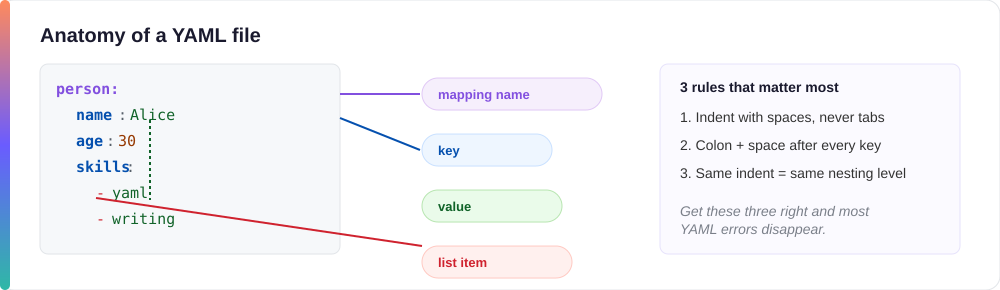

# 4. YAML Basic Concepts



New to YAML? Think of a YAML file like a very tidy, very picky notepad: no angle brackets, no curly braces — just words, colons, and careful spacing. This page walks through every building block one at a time, in plain English, with copy-pasteable examples for each.

Table of contents

- [Comments in YAML](#comments-in-yaml)
- [Scalars in YAML](#scalars-in-yaml)
- [Strings in YAML](#strings-in-yaml)
- [Implicit and explicit typing in YAML](#implicit-and-explicit-typing-in-yaml)
- [Timestamps in YAML](#timestamps-in-yaml)
- [Sequences in YAML](#sequences-in-yaml)
- [Dictionaries in YAML](#dictionaries-in-yaml)

## Comments in YAML

- `#` is used for comments in YAML.
- Comments can be inline, after a value, as well as on their own line.
- The commented part is ignored by the parser.
- YAML doesn't support multi-line comment blocks — if multiple lines need to be commented, each line needs its own `#`.
- This is similar to comments in Python.

```yaml
# this is a full-line comment
name: Alice  # this is an inline comment
```

## Scalars in YAML

A **scalar** is just a fancy word for a single, plain value — think of it like one sticky note with one label and one answer written on it. Nothing is nested inside it.

- Scalars are assigned to a "key" name as its value.
- Define a key, followed by a colon and a space after the colon, then add the value after the colon.
- Key and value are always separated by `:` (colon) and a space — do not use a tab.

Example of a scalar value: `name: alice`

Scalar data types can be common types like integer, floating point numeric value, boolean, string, or null. Examples below (format: data type → key: value):

- integer → `version: 2`
- float → `acceleration_gravity: 9.81`
- boolean → `isGloballyAvailable: true` (boolean values can also be written as `yes`/`no`)
- null → `no-value: null` (null can also be represented using `~`, or simply leaving no value after the key)
- string → `name: alice`
- positive infinity → `positive-infinity: Infinity` (can be shortened to `.inf`)
- negative infinity → `negative-infinity: -Infinity` (can be shortened to `-.inf`)
- invalid number → `invalidNum: Nan`

## Strings in YAML

- Strings in YAML don't need to be explicitly wrapped in double or single quotes.
- Only use single or double quotes in YAML if your value includes a special character such as `{`, `}`, `[`, `]`, `"`, `'`, `&`, `:`, `*`, `#`, `?`, `.`, `-`, `<`, `>`, `=`, `!`, `%`, `@`, `\`.
- `Yes` and `No` without quotes are interpreted as booleans. If you want `Yes`/`No` to be treated as strings, enclose them in single or double quotes.

Long strings can use the following special block styles:

- `>` (folded style) — removes newline characters from the string, folding lines into a single line separated by spaces.
- `|` (literal style) — turns each newline in the string into a literal newline (`\n`), preserving line breaks.

You can also control what happens to the blank space at the *very end* of the string, using a "chomping indicator" (`-` or `+`) right after `>` or `|`. Don't worry about memorizing all of these — plain `|` and `>` cover almost every real situation; the variants below are for the rare case where trailing blank lines actually matter:

- `>`, `|` — **clip** (the default): keep one final line break, drop any extra blank lines after it.
- `>-`, `|-` — **strip**: drop the final line break entirely.
- `>+`, `|+` — **keep**: keep the final line break *and* any blank lines after it.

```yaml
folded: >
  This is a long sentence
  that will be folded into
  a single line.
literal: |
  Line one
  Line two
stripped: |-
  No trailing newline kept
kept: |+
  Trailing blank lines are kept

```

## Implicit and explicit typing in YAML

YAML can implicitly understand data types — for example `1`, `2`, `3` are integers, `1.0`, `2.0` are floats, `true`, `false`, `yes`, `no` are booleans, and so on.

But if you want to explicitly tell the YAML parser the data type of a scalar value, you can use the double exclamation type tag `!!<type>`:

```yaml
YAML-is-cool: !!bool true
```

Why use explicit typing?

- To improve readability.
- To validate your YAML and catch data type errors.

More explicit typing examples:

- `!!int` for integer
- `!!float` for float
- `!!str` for string
- `!!bool` for boolean
- `!!null` for null

You'll rarely need to type these yourself — YAML almost always guesses the right type on its own. It's still good to recognize `!!` when you spot it in someone else's file, so it doesn't look like a typo.

## Timestamps in YAML

You almost never type a timestamp by hand — a tool usually generates it for you (a build system, a log, a CI pipeline). This section is here so the formats look familiar when you see them, not because you need to memorize them.

- A timestamp represents a single point in time.
- The explicit type tag for a timestamp is `!!timestamp`.
- YAML supports several timestamp formats: canonical, ISO 8601, space-separated, no time zone, and date-only.

| Format | Example |
|---|---|
| Canonical | `2001-12-15T02:59:43.1Z` |
| ISO 8601 | `2001-12-14t21:59:43.10-05:00` |
| Space separated | `2001-12-14 21:59:43.10 -5` |
| No time zone (assumed Z) | `2001-12-15 2:59:43.10` |
| Date only (00:00:00Z) | `2002-12-1` |

- If the time zone is omitted, the timestamp is assumed to be UTC.
- The time part can be omitted altogether — this results in a "date" format, which is assumed to be `00:00:00Z` (start of the UTC day).
- A time zone can be included by specifying how many hours it is ahead of or behind UTC. For example, EST can be set with a `-5` at the end: `2001-12-14 21:59:43.10 -5`.

## Sequences in YAML

A **sequence** is just a list — the YAML word for what most programming languages call an array.

- Sequences are values listed in a specific order.
- Sequences are like a list or array in programming languages.
- Sequences can be defined in **block style** or **flow (inline) style**.
- Block style uses a dash (hyphen) and a space.
- Flow style uses square brackets, similar to a JSON array.
- Sequences can be nested inside another sequence.

### Sequence examples

```yaml
# Sequence example 1 - block style (most common)
platformTeam:
  - Alice
  - Bob
  - Carla

# Sequence example 2 - flow (inline) style, same meaning as above
supportTeam: ["David", "Elena"]

# Sequence example 3 - a sequence nested inside another sequence
# "teams" here is a list of lists — nested lists can go to any depth.
teams:
  - platformTeam:
      - Alice
      - Bob
      - Carla
  - supportTeam:
      - David
      - Elena
```

> Note: names above are placeholders, kept simple for illustration only.

## Dictionaries in YAML

A **dictionary** (also called a **mapping**) is like a business card: several labeled fields — name, title, phone — grouped together under one contact. Each field is a key-value pair, just like the scalars you already saw, but now grouped under a shared name.

- Dictionaries are also called **mappings** in YAML.
- A dictionary, like in any other language, is a set of key-value pairs.
- A dictionary is defined with a name, a colon, and a space, followed by one or more indented key-value pairs.
- A dictionary is like a JSON object.

Let's see how to create a dictionary for an `Employee` with keys `empid`, `name`, and `location`:

```yaml
Employee:
  empid: 1
  name: Alice
  location: San Ramon
```

Now let's add a few employee objects to a list called `employees` (plural):

```yaml
employees:
  - empid: 1
    name: Bob
    location: Mountain View
  - empid: 2
    name: Alice
    location: San Ramon
  - empid: 3
    location: San Mateo
```

Notice employee 3 has no `name` — YAML doesn't require every item in a list to have the same fields. That's fine, and it's a good habit to check for missing fields like this in your own data.

Here's the equivalent JSON, so you can see the two side by side. (Try it yourself with any online "YAML to JSON" converter.)

```json
{
  "employees": [
    {
      "empid": 1,
      "name": "Bob",
      "location": "Mountain View"
    },
    {
      "empid": 2,
      "name": "Alice",
      "location": "San Ramon"
    },
    {
      "empid": 3,
      "location": "San Mateo"
    }
  ]
}
```

## Common pitfalls

- Mixing tabs and spaces — always use spaces.
- Wrong indentation levels — rely on your editor's indentation helpers.

## Exercise

Write a YAML snippet for a simple todo item with a title, due date, and a list of tags.

Example answer:

```yaml
todo:
  title: "Buy groceries"
  due: 2026-09-20
  tags:
    - shopping
    - errands
```

---

[← Previous: Creating a Simple YAML](03-creating-simple-yaml-vscode.md) · [🏠 Home](../index.md) · [Next: YAML Advance Concepts →](05-advance-concepts.md)
