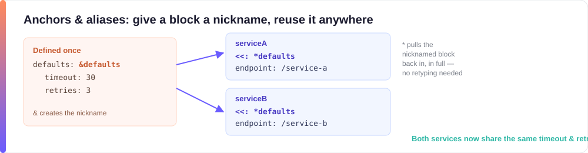

# 5. YAML Advanced Concepts (for curious beginners)

These are the features you'll bump into once you start *reading* other people's YAML — a Kubernetes manifest, a CI pipeline, a shared config file — rather than things you need to memorize to write your own. Skim through once so none of it looks alien later; you can always come back and copy an example when you actually need it.

Table of contents

- [Complex Keys in YAML](#complex-keys-in-yaml)
- [Anchors and Alias in YAML](#anchors-and-alias-in-yaml)
- [Overriding in YAML](#overriding-in-yaml)
- [Multiple YAML documents in a single YAML file](#multiple-yaml-documents-in-a-single-yaml-file)

## Complex Keys in YAML

Fair warning up front: complex keys are rare in real-world YAML. Almost everything you write will use a plain word as a key (like `name:` or `age:`). This section exists so the `?` syntax doesn't confuse you if you ever spot it — not because you'll need to write it often.

A complex key is a key that is itself a multiline string, a sequence, or another non-scalar structure — not just a plain word. Complex keys begin with a `?` (question mark).

```yaml
# Complex key example 1 - multiline string as a key
? this is an
  example of
  a complex key
: this is its value

# Complex key example 2 - sequence as a key
? - x
  - y
  - z
: [1, 2, 3]

# Complex key example 3 - sequence as a key, a more practical example
? - dev
  - qa
  - production
: - https://dev.server.com
  - https://qa.server.com
  - https://prod.server.com
```

> **Good to know:** complex keys are valid YAML, but there's no JSON equivalent to show here — JSON object keys must be plain strings, so a sequence-as-key has nothing to convert to. This is one of the few things you can write in YAML that JSON simply cannot represent.

## Anchors and Alias in YAML



Think of an anchor as giving a **nickname** to a block of YAML, so you can reuse it later by name instead of retyping (or copy-pasting) the whole thing.

- `&` is used to define an **anchor** for a chunk of values — like saying "call this block `uslocations`."
- `*` is used to **refer** to that chunk anywhere else in the document — "insert `uslocations` here."
- Anchors are very useful for repetitive sections in YAML.
- Anchors and aliases sometimes remind people of pointers in C.
- The one restriction: an anchor/alias name cannot contain `[`, `]`, `,`, or `{` characters.

Let's construct a list of ExampleCorp office locations, anchor them by country, and then say which employee can report to which country's locations.

```yaml
ExampleCorpLocations:
  USALocations: &uslocations
    - Denver, Colorado
    - Phoenix, Arizona
    - Nashville, Tennessee
    - Columbus, Ohio
    - Raleigh, North Carolina
    - Salt Lake City, Utah
    - Tampa, Florida
    - Boise, Idaho
    - Madison, Wisconsin
    - Reno, Nevada
    - Richmond, Virginia
    - Spokane, Washington
    - Tucson, Arizona
  CanadaLocations: &canlocations
    - Calgary
    - Edmonton
    - Winnipeg
    - Regina
    - Quebec City
    - Victoria
    - Kingston

employees:
  - employee:
      name: Alice
      canreportto: *uslocations
  - employee:
      name: Bob
      canreportto: *canlocations
```

Note the use of `&` and `*` to define and reuse the location lists — `*uslocations` simply expands to the full list defined above, wherever it's referenced.

The corresponding JSON:

```json
{
  "ExampleCorpLocations": {
    "USALocations": [
      "Denver, Colorado",
      "Phoenix, Arizona",
      "Nashville, Tennessee",
      "Columbus, Ohio",
      "Raleigh, North Carolina",
      "Salt Lake City, Utah",
      "Tampa, Florida",
      "Boise, Idaho",
      "Madison, Wisconsin",
      "Reno, Nevada",
      "Richmond, Virginia",
      "Spokane, Washington",
      "Tucson, Arizona"
    ],
    "CanadaLocations": [
      "Calgary",
      "Edmonton",
      "Winnipeg",
      "Regina",
      "Quebec City",
      "Victoria",
      "Kingston"
    ]
  },
  "employees": [
    {
      "employee": {
        "name": "Alice",
        "canreportto": [
          "Denver, Colorado",
          "Phoenix, Arizona",
          "Nashville, Tennessee",
          "Columbus, Ohio",
          "Raleigh, North Carolina",
          "Salt Lake City, Utah",
          "Tampa, Florida",
          "Boise, Idaho",
          "Madison, Wisconsin",
          "Reno, Nevada",
          "Richmond, Virginia",
          "Spokane, Washington",
          "Tucson, Arizona"
        ]
      }
    },
    {
      "employee": {
        "name": "Bob",
        "canreportto": [
          "Calgary",
          "Edmonton",
          "Winnipeg",
          "Regina",
          "Quebec City",
          "Victoria",
          "Kingston"
        ]
      }
    }
  ]
}
```

*(Verified: this YAML and JSON pair was round-tripped through a real YAML parser, not hand-written, so what you see above is exactly what a parser produces.)*

> **Watch your indentation:** everything that belongs *inside* a key must be indented **further** than that key, not just to the same column. Get this wrong and lines you meant to nest become siblings instead — for example:
>
> ```yaml
> # ❌ name and canreportto line up with "employee:" -> they become siblings, "employee" ends up empty
> - employee:
>   name: Alice
>   canreportto: *uslocations
>
> # ✅ name and canreportto are indented further -> correctly nested inside "employee"
> - employee:
>     name: Alice
>     canreportto: *uslocations
> ```
>
> There's no closing brace in YAML to save you if a line is one space off — when something parses "wrong," check indentation first.

## Overriding in YAML

After defining an anchor, you may want to reuse the same block but change just one or two values. This is like inheriting someone else's settings and tweaking only the field you care about — that's what **overriding** does.

- To override, use `<<:` before the alias.
- This merges the anchored mapping into the current mapping, and any keys you redefine below take precedence.

In the following example, `qa`, `dev`, and `prod` environments are defined once and anchored. In `deployTo`, the anchored environments are merged in, but the `qa` value is overridden.

```yaml
---
environments:
  defined_environments: &definedenv
    qa: https://qa
    dev: https://dev
    prod: https://prod

deployTo:
  <<: *definedenv
  qa: https://newqa
```

Note the use of `<<:` before the alias `*definedenv` to merge in the anchored mapping.

> **Good to know:** the `<<` merge key comes from YAML 1.1, not the newer YAML 1.2 core spec. Most tools you'll actually use it with — PyYAML (Python/Ansible), Go's `yaml.v2`/`yaml.v3` (Kubernetes tooling), Ruby's Psych — support it out of the box. A small number of strict YAML 1.2-only parsers don't merge automatically and will instead give you a literal `<<` key. If a merge doesn't seem to be happening, that's the first thing to check.

The corresponding JSON:

```json
{
  "environments": {
    "defined_environments": {
      "qa": "https://qa",
      "dev": "https://dev",
      "prod": "https://prod"
    }
  },
  "deployTo": {
    "qa": "https://newqa",
    "dev": "https://dev",
    "prod": "https://prod"
  }
}
```

## Multiple YAML documents in a single YAML file

This is rare in application config files, but common in tools like Kubernetes, where one file can describe several resources back to back, each separated by `---`.

- A document starts with three dashes (`---`) and ends with three dots (`...`).
- Some YAML processors require the document start marker — for example, Java's Jackson will not process a YAML document without `---`, while Python's PyYAML will.
- The end marker (`...`) is usually optional.
- When converting to JSON, only the first YAML document in the file will be parsed, because JSON has no concept of multiple documents in a single file.

```yaml
---
doc: first
---
doc: second
...
```

## Tags and explicit types

- YAML can tag nodes with explicit types (see [YAML Basic Concepts](04-basic-concepts.md#implicit-and-explicit-typing-in-yaml)) — use this sparingly in simple configs.
- Example: `!!str "123"` forces the value to be treated as a string rather than a number.

## Exercise

Use an anchor to avoid repeating the same database connection settings for two services.

Hint (short): define `db: &db` and reference `*db` in both service definitions.

---

[← Previous: YAML Basic Concepts](04-basic-concepts.md) · [🏠 Home](../index.md) · [Next: Validating YAML with yamllint →](06-validating-yaml-yamllint.md)
