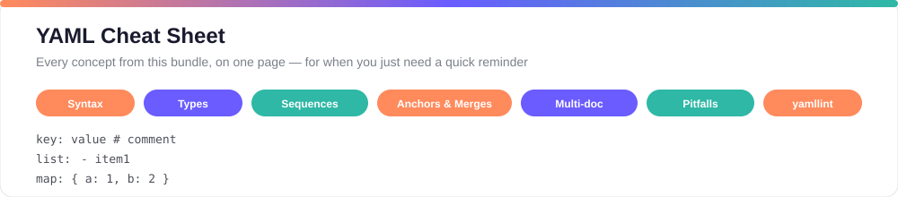

# 7. YAML Cheat Sheet



You've read all six lessons — this page is the one you'll actually keep open in a tab. No new concepts here, just every rule and pattern from this bundle in one scannable place. Bookmark it.

## Table of contents

- [Syntax basics](#syntax-basics)
- [Scalar types](#scalar-types)
- [Strings & multi-line text](#strings--multi-line-text)
- [Sequences (lists)](#sequences-lists)
- [Dictionaries (mappings)](#dictionaries-mappings)
- [Explicit type tags](#explicit-type-tags)
- [Timestamps](#timestamps)
- [Anchors, aliases & overriding](#anchors-aliases--overriding)
- [Complex keys](#complex-keys)
- [Multiple documents in one file](#multiple-documents-in-one-file)
- [Common pitfalls checklist](#common-pitfalls-checklist)
- [Validating with yamllint](#validating-with-yamllint)

## Syntax basics

| Rule | Example |
|---|---|
| Key : value, always with a space after the colon | `name: Alice` |
| Comments start with `#` | `age: 30  # in years` |
| Indent with **spaces only** — never tabs | `person:`<br>`  name: Alice` |
| Same indentation = same nesting level | see [Basic Concepts](04-basic-concepts.md) |
| Case sensitive | `name` ≠ `Name` |
| File extension | `.yaml` or `.yml` (both valid) |

## Scalar types

| Type | Example |
|---|---|
| Integer | `version: 2` |
| Float | `gravity: 9.81` |
| Boolean | `enabled: true` (also `yes` / `no`) |
| Null | `value: null` (also `~`, or nothing at all) |
| String | `name: Alice` |
| Positive infinity | `x: Infinity` or `x: .inf` |
| Negative infinity | `x: -Infinity` or `x: -.inf` |
| Not a number | `x: NaN` |

Quote a string only when it contains a special character: `{ } [ ] , & : * # ? . - < > = ! % @ \` or when it's `Yes`/`No` and you need it to stay text, not become a boolean.

## Strings & multi-line text

| Style | Symbol | Behavior |
|---|---|---|
| Folded | `>` | Joins lines into one, replacing line breaks with spaces |
| Literal | `|` | Keeps each line break exactly as written |
| Clip (default) | `>` / `|` | Keeps one final line break, drops extra blank lines |
| Strip | `>-` / `|-` | Removes the final line break entirely |
| Keep | `>+` / `|+` | Keeps the final line break *and* trailing blank lines |

```yaml
folded: >
  This becomes
  one single line.
literal: |
  Line one
  Line two
```

## Sequences (lists)

```yaml
# Block style (most common)
skills:
  - yaml
  - writing

# Flow style (inline, JSON-like) - same meaning, different key so both fit in one example
tags: [yaml, writing]

# Nested sequence
teams:
  - platformTeam:
      - Alice
      - Bob
```

## Dictionaries (mappings)

```yaml
# Single mapping
person:
  name: Alice
  age: 30

# List of mappings
employees:
  - empid: 1
    name: Bob
  - empid: 2
    name: Alice
```

## Explicit type tags

Rarely needed — YAML almost always infers the right type — but good to recognize:

| Tag | Forces |
|---|---|
| `!!int` | Integer |
| `!!float` | Float |
| `!!str` | String |
| `!!bool` | Boolean |
| `!!null` | Null |
| `!!timestamp` | Timestamp |

```yaml
YAML-is-cool: !!bool true
```

## Timestamps

| Format | Example |
|---|---|
| Canonical | `2001-12-15T02:59:43.1Z` |
| ISO 8601 | `2001-12-14t21:59:43.10-05:00` |
| Space separated | `2001-12-14 21:59:43.10 -5` |
| No time zone (assumed UTC) | `2001-12-15 2:59:43.10` |
| Date only | `2002-12-1` |

## Anchors, aliases & overriding

```yaml
# Define once, anchor it with &
defaults: &defaults
  timeout: 30
  retries: 3

# Reuse it anywhere with *
serviceA:
  <<: *defaults
  endpoint: /service-a

# Override just one value after merging
serviceB:
  <<: *defaults
  timeout: 60          # wins over the anchored value
  endpoint: /service-b
```

- `&name` — define an anchor (a nickname for a block).
- `*name` — insert that block by reference.
- `<<: *name` — merge a mapping's keys into the current one; anything you redefine below wins.
- ⚠️ Indentation matters: everything meant to nest under a key must be indented *further* than that key, or it becomes a sibling instead. See [YAML Advance Concepts](05-advance-concepts.md#anchors-and-alias-in-yaml) for a worked example of exactly this mistake.
- `<<` merge keys are a YAML 1.1 feature — supported by PyYAML, Go's `yaml.v2`/`yaml.v3`, and Ruby's Psych, but not guaranteed on every strict YAML 1.2 parser.

## Complex keys

Rare, but here's the syntax if you spot it — a key that's a sequence or multi-line string, introduced with `?`:

```yaml
? - dev
  - qa
: - https://dev.server.com
  - https://qa.server.com
```

No JSON equivalent exists for this — JSON keys must be plain strings.

## Multiple documents in one file

```yaml
---
doc: first
---
doc: second
...
```

- `---` starts a new document; `...` ends one (usually optional).
- Some parsers (like Java's Jackson) require the leading `---`; others (like PyYAML) don't.
- Converting to JSON only keeps the *first* document — JSON has no multi-document concept.

## Common pitfalls checklist

- ☐ Tabs anywhere in the file (use spaces only)
- ☐ Missing space after a colon (`key:value` ❌ → `key: value` ✅)
- ☐ Inconsistent indentation between sibling items
- ☐ Unquoted `Yes`/`No` where you meant a string, not a boolean
- ☐ Assuming `<<` merge keys work in every parser
- ☐ Forgetting `-` needs a space after it in list items

## Validating with yamllint

```bash
pip install yamllint       # install once
yamllint file.yaml         # check one file
yamllint .                 # check everything in the current folder
```

---

[← Previous: Validating YAML with yamllint](06-validating-yaml-yamllint.md) · [🏠 Home](../index.md)
